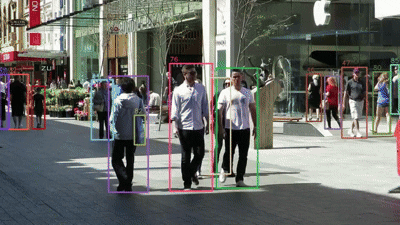
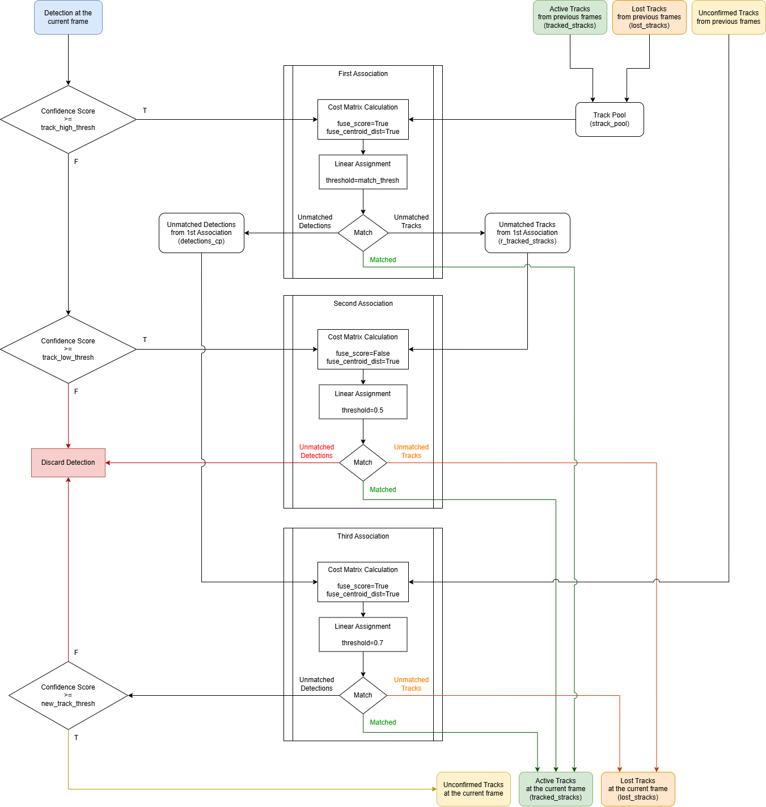

# ByteTrack C++ Implementation

C++ implementation of ByteTrack, based on [emptysoal/TensorRT-YOLOv8-ByteTrack](https://github.com/emptysoal/TensorRT-YOLOv8-ByteTrack/tree/main/bytetrack), modified to address the [ID switching issue](https://github.com/Vertical-Beach/ByteTrack-cpp/issues/20).



## Modifications

The following modifications were made to reproduce the tracker results of the [original Python implementation](https://github.com/ifzhang/ByteTrack).

- **High and Low Confidence Thresholds:** The original C++ implementation overlooked a core principle of ByteTrack — hierarchical matching based on separate high and low confidence thresholds.

- **Score Fusion:** The cost matrix computation did not take into account the detection model’s confidence scores, which are essential for accurate score fusion.

## Build and Run the Test Program

To build the test program, run:
```bash
source build.sh
```
To run the test program:
```bash
./build/test_app [/path/to/input/video.mp4] [/path/to/model/predictions] [/path/to/save/video.mp4]
```
**Note:** The test program expects model predictions in YOLO format, where each row in the label file represents a single object: `[class] [x] [y] [w] [h] [confidence]`.

Example using sample data:
```bash
./build/test_app data/MOT16-08-raw.mp4 data/MOT16-08-raw_labels result.mp4
```

## ByteTrack Logic Flow

ByteTrack is a real-time multi-object tracking algorithm that enhances data association by utilizing both high- and low-confidence detections — unlike traditional methods that discard low-confidence detections.

Its core innovation lies in a hierarchical matching strategy consisting of three stages:

- **First Association** matches high-confidence detections with confirmed tracks using IoU-based association.

- **Second Association** attempts to match the remaining confirmed tracks with low-confidence detections, recovering objects that may have been missed in the first stage.

- **Third Association** processes unconfirmed tracks and initializes new ones from unmatched detections.

The logic flow diagram reflects the actual ByteTrack source code, which slightly differs from the methodology described in [the original paper](https://www.ecva.net/papers/eccv_2022/papers_ECCV/papers/136820001.pdf).



## Parameters

| Parameter | Value | Description |
| --- | --- | --- |
| track_high_thresh | 0.5 | Detection confidence threshold for the first association: Lowering this threshold allows detections with lower confidence scores to be included in the first association stage. |
| track_low_thresh | 0.1 | Detection confidence threshold for the second association. Defines the minimum confidence score for detections to be considered in the second association stage. Lowering this threshold allows lower-confidence detections to be included. Detections with confidence scores below this value will be discarded entirely. |
| new_track_thresh | 0.6 | Confidence threshold for initializing new tracklets. Specifies the minimum confidence score required for unmatched detections to be considered as new tracklets. Lowering this threshold allows detections with lower confidence scores to initiate new tracks. | 
| match_thresh | 0.8 | Cost threshold for linear assignment. Sets the maximum allowable cost for associating detections with existing tracks. A lower threshold enforces stricter matching, which can reduce ID switches between nearby objects (good), but may also lead to more broken tracks (bad). |
| max_time_lost | 30 | Maximum number of frames to retain lost tracklets. Specifies how long (in frames) a lost tracklet is kept before being permanently removed. Increasing this value allows temporarily lost objects more time to reappear and be re-associated. |


## References

This repository is based on [emptysoal/TensorRT-YOLOv8-ByteTrack](https://github.com/emptysoal/TensorRT-YOLOv8-ByteTrack/tree/main/bytetrack), with modifications made to replicate the tracking performance of the [original Python implementation](https://github.com/ifzhang/ByteTrack).

The sample video is sourced from the [MOT Benchmark](https://motchallenge.net/vis/MOT16-08), and object detection is performed using [Ultralytics YOLOv8](https://github.com/ultralytics/ultralytics).
